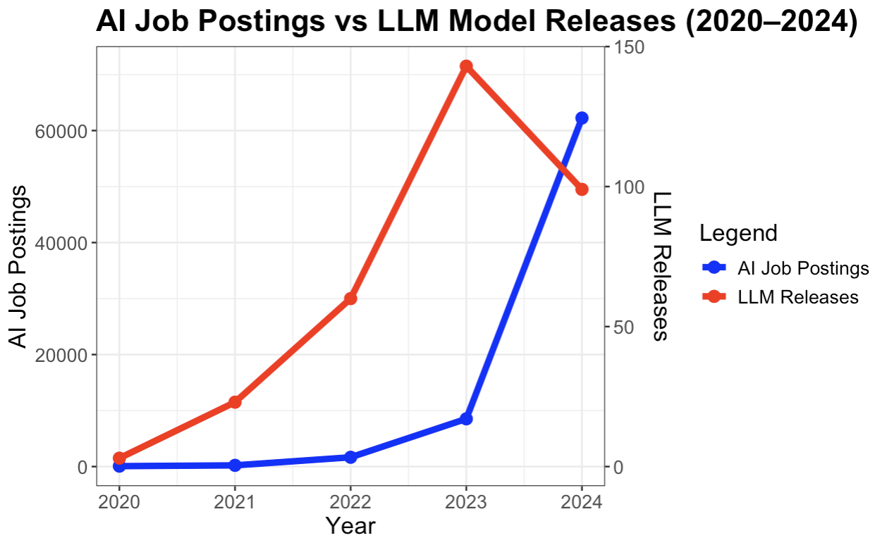
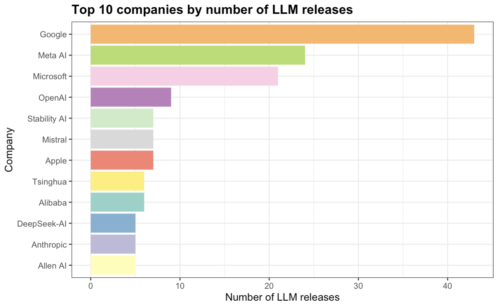
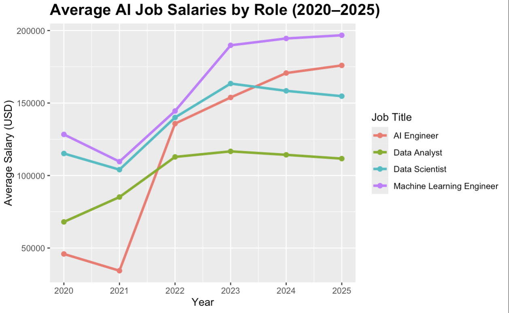
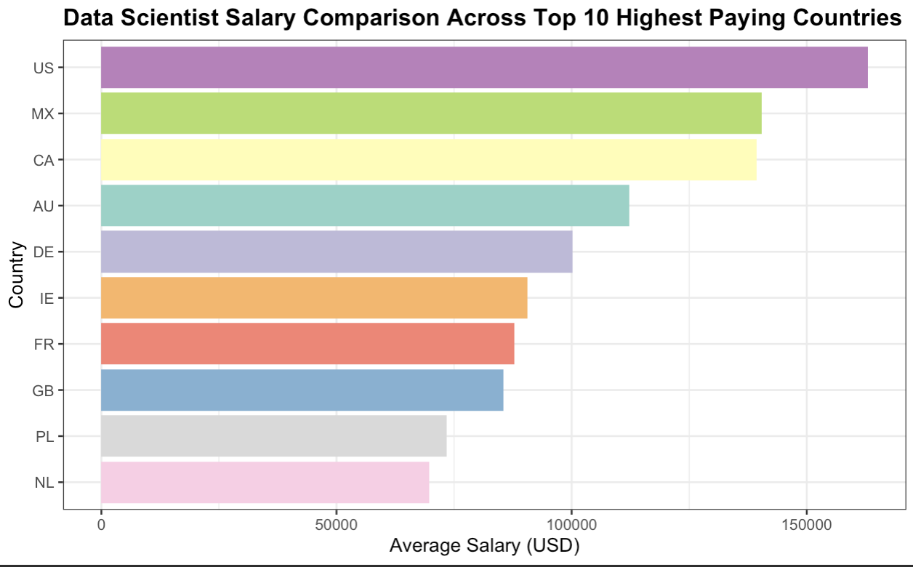

# INFO 201 Final Project: Large Language Models and the AI Job Market

[](https://opensource.org/licenses/Apache-2.0)
[](https://www.r-project.org/)
[](https://posit.co/download/rstudio-desktop/)


## Overview

**INFO 201 Final Project - Group 2**

This research project examines the relationship between **Large Language Model (LLM) development** and **AI job market trends** from 2020 to 2025. By analyzing 151,445 job postings and 342 LLM releases, we provide actionable insights for students, career advisors, and early-career professionals navigating the rapidly evolving AI landscape.

**Team Members:**
- [Joseph Chamdani](https://github.com/josephdavisc)
- [Winson Teh](https://github.com/win719)
- [Kenneth Wu](https://github.com/kennethwu30)
- [Hanjun Ma](https://github.com/decade3601)

**Course:** INFO 201 -  Intro to data programming, University of Washington

---

## Research Questions

This analysis addresses four key questions:

1. **Market Correlation:** How does the growth in LLM releases from 2020 to 2024 correlate with the number of AI related job postings during the same period?
2. **Role Hierarchy:** Are bigger AI models associated with more LLM releases in certain companies?
3. **Corporate Strategy:** Which specific AI job titles have the highest average salaries from 2020 to 2025?
4. **Geographic Variation:** Which countries pay the highest AI salaries, and how do the top countries compare when controlling for the same job role?

---

## Repository Structure

```
INFO_201/
│
├── Data/                              # Raw datasets
│   ├── job-salaries.csv              # 151,445 AI job postings (2020-2025)
│   └── large-language-models.csv     # 342 LLM releases (2018-2024)
│
├── Graphs/                            # Generated visualizations
│   ├── RQ1.png                       # LLM releases vs job postings
│   ├── RQ2_LLM_Model.png            # Companies by model size
│   ├── RQ2_LLM_Release.png          # Companies by release frequency
│   ├── RQ3.png                       # Salary trends by role
│   └── RQ4.png                       # Salary comparison by country
│
├── Media/                             # Project assets
│   └── AI_Job_Market_&_LLM_Growth.png
│
├── final_code_group_2.Rmd            # Complete analysis with code
├── final_code_group_2.html           # Rendered analysis (code visible)
│
├── final_report_group_2.Rmd          # Polished report (code hidden)
├── final_report_group_2.html         # Final deliverable
│
├── LICENSE                            # Apache License 2.0
└── README.md                          # Project documentation
```

---

## Getting Started

### Quick Preview

**View the live report without running any code:**
- [**View Final Report Online**](https://uw.joechamdani.com/projects/INFO_201/final_report_group_2)
- [**View Project Presentation (PDF)**](INFO_201_Project_Presentation.pdf)

---

### Prerequisites

- **R** (version 4.0 or higher)
- **RStudio** (recommended IDE)
- **tidyverse** package

### Installation

1. **Clone the repository:**
   ```bash
   git clone https://github.com/josephdavisc/INFO_201.git
   cd INFO_201
   ```

2. **Install required R packages:**
   ```r
   install.packages("tidyverse")
   ```

3. **Open the RStudio project:**
   - Double-click [INFO_201.Rproj](INFO_201.Rproj)

### Running the Analysis

1. **Open the code file:**
   - Navigate to [final_code_group_2.Rmd](final_code_group_2.Rmd)

2. **Knit to HTML:**
   - Click the **Knit** button in RStudio
   - Output will generate as [final_code_group_2.html](final_code_group_2.html)

3. **View the final report:**
   - Open [final_report_group_2.html](final_report_group_2.html) in any web browser

---

## Data Sources

### AI Job Salaries Dataset
**Source:** [Kaggle - Salaries for Data Science Jobs](https://www.kaggle.com/datasets/adilshamim8/salaries-for-data-science-jobs)

- **Coverage:** 2020-2025
- **Size:** 151,445 rows, 11 columns
- **Key Variables:**
  - Job titles and roles
  - Salaries (in USD)
  - Experience levels
  - Employment type
  - Company size and location
  - Employee residence (country)

### Large Language Models Dataset
**Source:** [Kaggle - LLMs Data (2018-2024)](https://www.kaggle.com/datasets/jainaru/llms-data-2018-2024)

- **Coverage:** 2018-2024
- **Size:** 342 rows, 11 columns
- **Key Variables:**
  - Model names
  - Developing companies
  - Model parameters (size)
  - Release dates
  - Training datasets
  - Token counts

**License:** Both datasets are publicly available for educational and research purposes.

---

## Key Findings

### 1. AI Job Postings vs LLM Releases (2020-2024)



From 2020 to 2024, both AI job postings and LLM releases increased rapidly. Job postings rose from 75 in 2020 to over 62,000 in 2024, while LLM releases grew from 3 to nearly 100 during the same period. The steep jump in job postings after 2022 aligns closely with the surge in model releases, suggesting that growth in LLM development is strongly associated with rising demand for AI workers.

---

### 2. Largest Models vs Most Releases

 | 

Companies releasing the biggest models are not the ones releasing the most models. Meta AI produces the largest models, but Google, Meta AI, and Microsoft dominate in release count. This indicates that producing bigger models does not necessarily correlate with releasing more models. Some companies prioritize size, while others prioritize volume.

---

### 3. AI Job Salaries by Role (2020-2025)



From 2020 to 2025, Machine Learning Engineers earned the highest average salaries every year. AI Engineers ranked second, followed by Data Scientists and Data Analysts. The sharp increases starting in 2022 suggest that high demand for engineering focused roles corresponds with rising salary levels.

---

### 4. Country Differences in AI Salaries



Across the top ten highest paying countries for Data Scientists, the United States consistently offers the highest salaries, with Mexico and Canada just behind. One possible explanation is that these three countries share strong cross-border technology integration, with many US-based AI companies operating or expanding into Canada and Mexico. This creates a closely connected regional market with high demand for AI talent, which helps keep salary levels elevated across all three countries.

---

## Methodology

### Data Cleaning and Processing

1. **Job Salaries Dataset:**
   - Standardized job titles using keyword detection (`grepl` function)
   - Consolidated roles into 4 categories: Machine Learning Engineer, AI Engineer, Data Scientist, Data Analyst
   - Filtered for complete records (removed rows with missing salary or year data)

2. **LLM Dataset:**
   - Normalized company names (consolidated Google variants: "Google", "Google AI", "Google DeepMind" to "Google")
   - Cleaned parameter values (removed non-numeric characters)
   - Extracted year from release date strings

3. **Integration:**
   - Merged datasets by year for temporal correlation analysis
   - Aggregated data by country, role, and company for comparative analysis

### Analysis Techniques

- **Time Series Analysis:** Tracking year-over-year trends
- **Categorical Grouping:** Comparing by role, company, and geography
- **Statistical Summarization:** Mean salaries, counts, and distributions
- **Correlation Analysis:** Examining relationships between LLM metrics and job metrics

---

## Technologies Used

- **Language:** R (version 4.0+)
- **Core Packages:**
  - `tidyverse` - Data manipulation and visualization
  - `ggplot2` - Statistical graphics
  - `dplyr` - Data transformation
  - `readr` - Data import
- **Environment:** RStudio
- **Output Format:** R Markdown (knitted to HTML)

---

## Reproducibility

All analysis steps are fully documented and transparent:

- Complete data cleaning procedures in [final_code_group_2.Rmd](final_code_group_2.Rmd)
- All visualizations generated from reproducible code
- Raw datasets included in the repository
- No proprietary or closed-source tools required

To reproduce the analysis, follow the steps in the [Getting Started](#getting-started) section.

---

## Contributing

This project was completed as a course requirement for INFO 201. While we are not actively maintaining the repository, we welcome feedback and discussion:

- Open an issue for questions or suggestions
- Fork the repository for your own analysis

---

## License

This project is licensed under the **Apache License 2.0** - see the [LICENSE](LICENSE) file for details.

---

## Acknowledgments

- **Data Sources:** Kaggle community for providing public datasets
- **Course:** INFO 201 - Intro to data programming, University of Washington
- **Instructor:** Ott Toomet

---

## Contact

For questions or collaboration opportunities, reach out to the team members:

- Joseph Chamdani - [GitHub](https://github.com/josephdavisc)
- Winson Teh - [GitHub](https://github.com/win719)
- Kenneth Wu - [GitHub](https://github.com/kennethwu30)
- Hanjun Ma - [GitHub](https://github.com/decade3601)

---

**Last Updated:** December 2025
